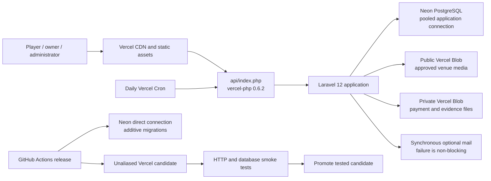
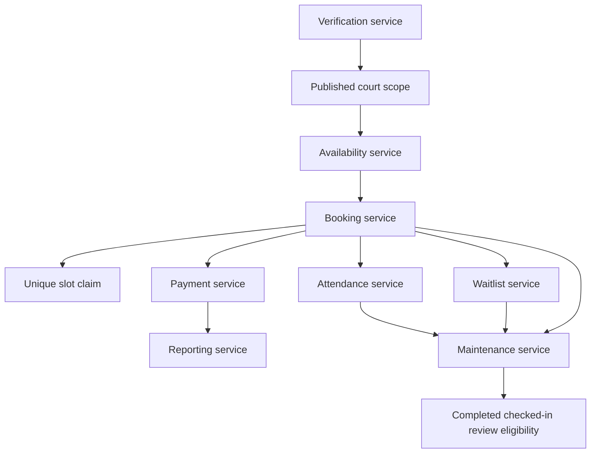

# Architecture

## Runtime overview

Static CSS, JavaScript, fonts, images, and video are served from `public`. Dynamic requests enter Laravel through `api/index.php`. Framework-generated temporary files use `/tmp` on Vercel; durable state uses PostgreSQL or Blob.

## Domain boundaries

### Verification

Each evidence record links to one or more field claims. Accepted claims store a hash of the fact at review time. Editing the fact invalidates the claim and unpublishes the court.

### Availability and booking

Schedule slots are generated in `Asia/Manila` from operating hours and active schedule rules, then filtered by blackouts and occupying bookings. Price and time are selected again on the server. A transaction inserts both the booking and its unique `(court_unit_id, slot_starts_at)` claim, making the database the final concurrency guard.

### Payments

Payment status is derived from verified collections minus refunds. Only one submitted proof may await review at a time, and submissions cannot exceed the remaining balance. Private proof media is served through policy-protected Laravel routes.

### Attendance

The QR payload carries only a random token prefixed with `KPP-CHECKIN:`. Only its SHA-256 hash is stored. A manager of the booked court can check in a confirmed booking from 30 minutes before until 30 minutes after its start.

### Maintenance

Request-driven maintenance expires pending reservations, releases slot claims, advances waitlists, expires priority offers, and marks ended confirmed reservations as completed or no-show. Daily Vercel Cron supplies cleanup redundancy.

## Frontend performance

- Leaflet loads only for pages containing map components.
- QR generation and scanning load only on pass/scanner pages.
- Hero video includes a poster, mobile crop, pause control, and reduced-motion fallback.
- Court images use responsive source sets and Vercel Image Optimization when backed by public Blob.
- Reveal content remains visible when JavaScript fails.
